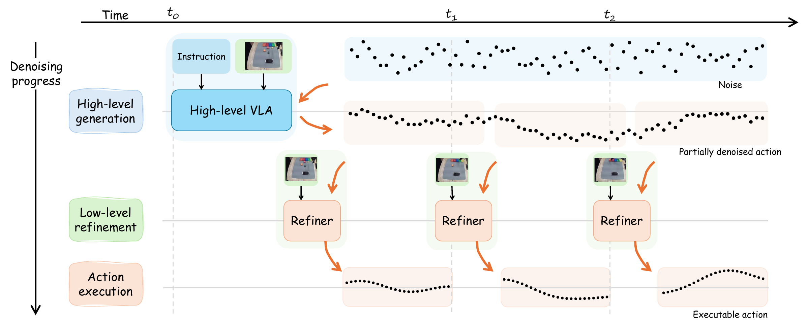
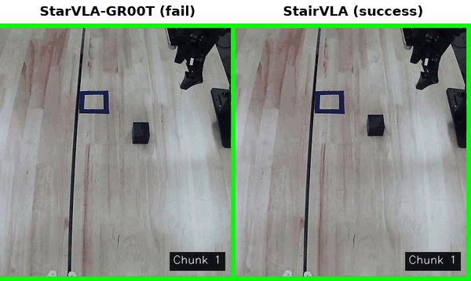
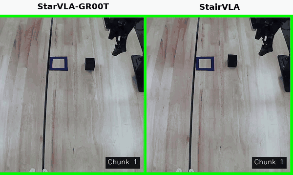
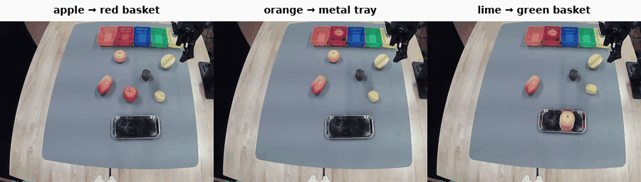
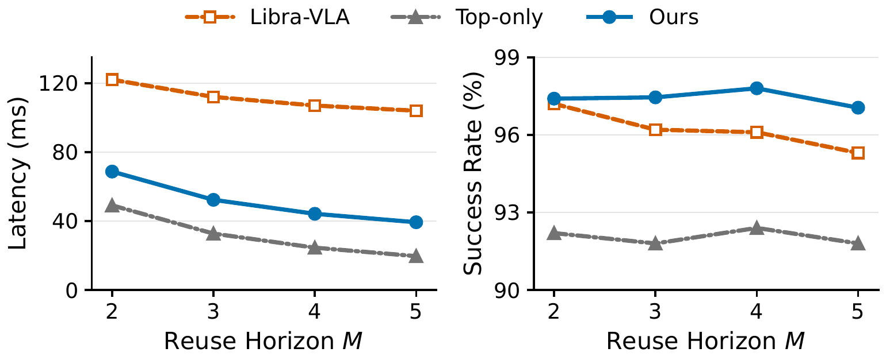
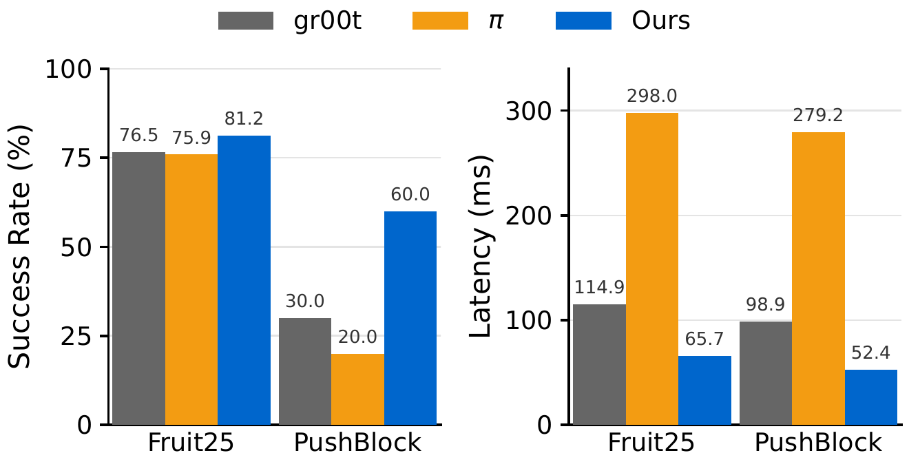

<div align="center">

# StairVLA: Stage-Aware Hierarchical Action Generation for Vision-Language-Action Models

Shangyuan Yuan<sup>1</sup>, Xinda Qi<sup>1,2</sup>, Yujiang Pu<sup>1</sup>, Wenliang Guo<sup>1</sup>, Xiaobo Tan<sup>1</sup>

<sup>1</sup>Michigan State University &nbsp;&nbsp; <sup>2</sup>Ant Group

[](https://arxiv.org/abs/2610.07756)
[](https://dicomsky.github.io/projects/stairvla)
[](#checkpoints-and-datasets)
[](LICENSE)

</div>

> **Built on [StarVLA](https://github.com/starVLA/starVLA).** Most of this repository (training
> loop, data loading, VLM interface, baseline frameworks, and the policy server) comes from
> StarVLA. Our contribution is the stage-aware hierarchical framework
> (`HierarchicalVLA.py`, `Hierarchical_ActionHead.py`) and its configurations. See [NOTICE](NOTICE)
> for file-level provenance.

<p align="center">
  
</p>

Flow-matching and diffusion action heads usually treat every denoising step the same way. We
observe that the conditioning focus shifts across denoising stages: early stages combine the
language instruction and visual observations to form a coarse trajectory, while later stages rely
more on the current observation to align the actions. StairVLA uses the **partially denoised
trajectory** as the interface between the two:

- a **high-level VLA** runs the early denoising steps and produces a long-horizon, partially denoised
  trajectory that is reused across several control cycles;
- a **lightweight refiner** runs at a higher frequency and finishes the denoising of each local
  action chunk from the latest observation.

This amortizes the expensive VLA forward pass while keeping frequent closed-loop correction. On
LIBERO, the GR00T-style instantiation improves average success from 96.5% to 97.8% while reducing
amortized inference latency from 115.0 ms to 44.2 ms per action chunk.

## Real-robot demos

PushBlock on an AgileX PiperX arm, top camera (5× speed). **Red border: model inference;
green border: action execution;** the counter shows how many action chunks have been executed.

| Hard initial configuration | Easy initial configuration |
|:---:|:---:|
|  |  |
| From a similar layout, StairVLA pushes the block into the target; StarVLA-GR00T does not. | Both succeed; StairVLA finishes at about 36 s, StarVLA-GR00T near the 50 s limit. |

Fruit25, StairVLA on three language-conditioned pick-and-place tasks (2× speed):

<p align="center">
  
</p>

## Results

### LIBERO

Success rate (%) over 500 trials per suite, one model trained jointly on all four suites. Latency
is per executable action chunk on one NVIDIA A100 and includes the amortized high-level cost.

| Method | Spatial | Object | Goal | Long | Avg. | Latency (ms) |
|---|:---:|:---:|:---:|:---:|:---:|:---:|
| StarVLA-GR00T<sup>†</sup> | 97.8 | 98.8 | 97.4 | 92.0 | 96.5 | 115.0 |
| **StairVLA (GR00T-base)** | 98.0 | 99.6 | 97.8 | 95.8 | **97.8** | **44.2** |
| StarVLA-π<sup>†</sup> | 99.2 | 99.0 | 97.2 | 95.8 | 97.8 | 183.3 |
| **StairVLA (π-base)** | 99.6 | 99.0 | 96.8 | 97.4 | **98.3** | **44.5** |

<sup>†</sup> Success rates as reported by [StarVLA](https://github.com/starVLA/starVLA). Comparisons
with other hierarchical and coarse-to-fine VLAs are in the paper.

Ablations (GR00T-base):

| Setting | Refiner | Action context | Spatial | Object | Goal | Long | Avg. |
|---|:---:|:---:|:---:|:---:|:---:|:---:|:---:|
| StarVLA-GR00T | – | – | 97.8 | 98.8 | 97.4 | 92.0 | 96.5 |
| High-level policy only (H=32) | ✗ | – | 96.8 | 89.4 | 96.8 | 86.4 | 92.4 |
| StairVLA w/o action context | ✓ | ✗ | 99.2 | 98.6 | 95.6 | 95.4 | 97.2 |
| **StairVLA** | ✓ | ✓ | 98.0 | 99.6 | 97.8 | 95.8 | **97.8** |

<p align="center">
  
  <br><em>Reusing each high-level trajectory for M refinement cycles cuts latency while keeping success high.</em>
</p>

### LIBERO-Plus

| Setting | Camera | Robot | Language | Light | Background | Noise | Layout | Avg. |
|---|:---:|:---:|:---:|:---:|:---:|:---:|:---:|:---:|
| Zero-shot (trained on LIBERO) | 43.7 | 54.5 | 82.5 | 93.4 | 90.5 | 67.8 | 74.0 | 70.4 |
| Fine-tuned on LIBERO-Plus | 95.5 | 48.4 | 83.7 | 96.8 | 94.9 | 95.4 | 77.4 | 83.7 |

### Real robot (AgileX PiperX)

All methods use Qwen3-VL-2B-Instruct and run on the same NVIDIA RTX A4000. Fruit25 has 24
single-fruit pick-and-place tasks plus one multi-object sorting task (170 trials per method);
PushBlock is one continuous pushing task (10 trials per method).

<p align="center">
  
</p>

## Installation

```bash
git clone https://github.com/Dicomsky/StairVLA
cd StairVLA

conda create -n stairvla python=3.10 -y
conda activate stairvla
pip install -r requirements.txt
pip install -e .
pip install flash-attn==2.7.4.post1 --no-build-isolation
```

To get later updates, run `git pull` inside the repository.

We used PyTorch 2.6.0 (CUDA 12.4) with flash-attn 2.7.4.post1. flash-attn must match your CUDA
toolkit and PyTorch build; if it fails to install, check `nvcc -V` and
`pip list | grep -E 'torch|flash-attn'` and pick a matching flash-attn release.

<details>
<summary><b>No flash-attn, or Blackwell GPUs (RTX 50-series, RTX PRO 6000 Blackwell)</b></summary>

PyTorch 2.6 has no kernels for Blackwell GPUs (compute capability sm_120), and flash-attn has no
sm_120 build. Install the CUDA 12.8 build of PyTorch after `requirements.txt`, skip flash-attn,
and use PyTorch's SDPA attention instead:

```bash
pip install torch==2.7.1 torchvision==0.22.1 --index-url https://download.pytorch.org/whl/cu128
```

Then set `framework.qwenvl.attn_implementation: sdpa` in the YAML you train with (the PiperX
configs already do). DeepSpeed calls `nvcc` when it loads, so make sure `CUDA_HOME` points to a
CUDA 12.8 or newer toolkit.

</details>

Download the VLM backbones into `playground/Pretrained_models/`. The refiner's SigLIP encoder
(`google/siglip-base-patch16-224`) is fetched from the Hugging Face Hub on first use.

```bash
# LIBERO and LIBERO-Plus
hf download Qwen/Qwen3-VL-4B-Instruct --local-dir playground/Pretrained_models/Qwen3-VL-4B-Instruct
# PiperX real robot
hf download Qwen/Qwen3-VL-2B-Instruct --local-dir playground/Pretrained_models/Qwen3-VL-2B-Instruct
```

## Training

StairVLA is trained in two stages:

1. **Stage 1** trains the high-level policy, a standard StarVLA model with a long action horizon (H=32).
2. **Stage 2** freezes it and trains the refiner. Each stage-2 config points to the stage-1
   checkpoint through `trainer.pretrained_checkpoint`.

| Benchmark | Stage 1 (high-level policy) | Stage 2 (refiner) |
|---|---|---|
| LIBERO, GR00T-base | [`run_stairvla_stage1.sh`](examples/LIBERO/train_files/run_stairvla_stage1.sh) | [`run_stairvla_stage2.sh`](examples/LIBERO/train_files/run_stairvla_stage2.sh) |
| LIBERO, π-base | [`run_stairvla_pi_stage1.sh`](examples/LIBERO/train_files/run_stairvla_pi_stage1.sh) | TODO: config to be released |
| LIBERO ablation: w/o action context | (same stage 1) | [`run_stairvla_stage2_no_context.sh`](examples/LIBERO/train_files/run_stairvla_stage2_no_context.sh) |
| LIBERO-Plus | [`run_stairvla_stage1.sh`](examples/LIBERO-plus/train_files/run_stairvla_stage1.sh) | [`run_stairvla_stage2.sh`](examples/LIBERO-plus/train_files/run_stairvla_stage2.sh) |
| PiperX Fruit25 | [`run_stairvla_stage1.sh`](examples/PiperX/fruit25/run_stairvla_stage1.sh) | [`run_stairvla_stage2.sh`](examples/PiperX/fruit25/run_stairvla_stage2.sh) |
| PiperX PushBlock | [`run_stairvla_stage1.sh`](examples/PiperX/pushblock/run_stairvla_stage1.sh) | [`run_stairvla_stage2.sh`](examples/PiperX/pushblock/run_stairvla_stage2.sh) |

Every hyperparameter lives in the YAML next to its launcher; each launcher copies itself and its
YAML into the run directory. Run from the repository root, for example:

```bash
bash examples/LIBERO/train_files/run_stairvla_stage1.sh   # 8 GPUs, 30k steps
bash examples/LIBERO/train_files/run_stairvla_stage2.sh   # 8 GPUs, 30k steps
```

Dataset preparation and evaluation for each benchmark:
[LIBERO](examples/LIBERO/README.md) · [LIBERO-Plus](examples/LIBERO-plus/README.md) ·
[PiperX](examples/PiperX/README.md). The StarVLA baselines are trained with the
[StarVLA](https://github.com/starVLA/starVLA) recipes; the PiperX baseline configs are included here.

## Evaluation

Evaluation uses StarVLA's client–server setup: the policy runs in a websocket server in this
environment, and the simulator runs in its own environment.

```bash
# Terminal 1 (stairvla env): serve the stage-2 checkpoint
bash examples/LIBERO/eval_files/run_policy_server.sh

# Terminal 2 (LIBERO env): run all four suites
LIBERO_HOME=/path/to/LIBERO bash examples/LIBERO/eval_files/eval_libero_all.sh
```

The server defaults follow the paper (α=0.97, M=4). To evaluate the high-level policy alone
(the "Top-only" ablation), start the server with `hier_eval_mode=top32`.

## Real-robot deployment and teleoperation

The PiperX code lives in [`examples/PiperX/`](examples/PiperX/README.md):

- [robot client and benchmark](examples/PiperX/deployment/README.md)
- [VR teleoperation and data collection](examples/PiperX/teleoperation/README.md)
- [dataset processing](examples/PiperX/dataset_tools/README.md)

## Checkpoints and datasets

<!-- TODO: add Hugging Face links once released -->

| Item | Link |
|---|---|
| StairVLA LIBERO checkpoints (stage 1 and stage 2) | TODO |
| StairVLA LIBERO-Plus checkpoints | TODO |
| PiperX Fruit25 / PushBlock datasets | TODO |
| PiperX checkpoints | TODO |

## Citation

```bibtex
@misc{yuan2026stairvla,
  title         = {StairVLA: Stage-Aware Hierarchical Action Generation for Vision-Language-Action Models},
  author        = {Yuan, Shangyuan and Qi, Xinda and Pu, Yujiang and Guo, Wenliang and Tan, Xiaobo},
  year          = {2026},
  eprint        = {2610.07756},
  archivePrefix = {arXiv},
  primaryClass  = {cs.RO},
  url           = {https://arxiv.org/abs/2610.07756}
}
```

Please also cite StarVLA, which this code is built on:

```bibtex
@misc{ye2026starvla,
  title         = {StarVLA: A Lego-like Codebase for Vision-Language-Action Model Developing},
  author        = {{StarVLA Community}},
  year          = {2026},
  eprint        = {2604.05014},
  archivePrefix = {arXiv},
  primaryClass  = {cs.RO},
  url           = {https://arxiv.org/abs/2604.05014}
}
```

## License and acknowledgements

StairVLA is released under the MIT License, the same license as StarVLA. The StarVLA copyright
notice is kept in [LICENSE](LICENSE), and [NOTICE](NOTICE) lists which files are original,
modified, or unchanged. Some action-head files keep NVIDIA license headers from GR00T.

We thank the [StarVLA](https://github.com/starVLA/starVLA) team for the codebase this work is built on,
and the authors of [GR00T](https://github.com/NVIDIA/Isaac-GR00T), [Qwen3-VL](https://github.com/QwenLM/Qwen3-VL),
[SigLIP](https://huggingface.co/google/siglip-base-patch16-224), [LeRobot](https://github.com/huggingface/lerobot),
[LIBERO](https://github.com/Lifelong-Robot-Learning/LIBERO), and
[LIBERO-Plus](https://github.com/sylvestf/LIBERO-plus).
