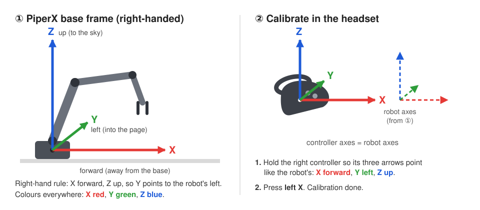

# VR Teleoperation and Data Collection for the AgileX PiperX

**[🌐 Project page](https://dicomsky.github.io/projects/stairvla)** · **[📄 Paper (arXiv)](https://arxiv.org/abs/2610.07756)** · part of [StairVLA](../../../README.md)

<!-- Demo video: add the link here once it is published. -->

We collected all PiperX demonstrations used in StairVLA with a **Meta Quest headset** through the
browser (WebXR). You put on the headset, hold the right grip, and the arm follows your hand.
Every episode is saved as a standard [LeRobot v3.0](https://github.com/huggingface/lerobot)
dataset. Three commands then turn a recording into the training data used in the paper.

- **No app to install on the headset.** Open a web page in the Quest browser and press one button.
- **No internet needed.** The page and all of its assets are served by the robot PC over your LAN.
- **No `lerobot` dependency.** Everything runs in the StairVLA Python environment.
- **Same pipeline as the paper.** Fruit25 and PushBlock were recorded and processed with exactly
  these tools.

---

## 1. What you need

| | |
|---|---|
| Robot | AgileX **PiperX** arm on a CAN interface (`can0`, 1 Mbit/s) |
| Cameras | a **top** UVC camera and a **wrist** Intel RealSense (we used an Innomaker U20CAM and a D435i), both 640×480 at 30 fps |
| Headset | **Meta Quest** 2, 3 or Pro (we used a Quest 3) |
| Robot PC | Linux, with the StairVLA environment; the Quest must be able to reach it over the network |

Install the robot-side packages into the StairVLA environment:

```bash
cd StairVLA
conda activate stairvla
pip install -r examples/PiperX/requirements.txt   # piper_sdk, pyrealsense2, opencv-python, ...
```

Bring up the CAN bus (once per boot) and, if a firewall is active, open the port used by the headset:

```bash
sudo ip link set can0 type can bitrate 1000000 && sudo ip link set can0 up
sudo ufw allow 8443/tcp
```

Find your camera settings:

```bash
python examples/PiperX/teleoperation/record.py --list-cameras
```

```
RealSense cameras (--wrist-realsense-serial):
  250122075719   RealSense D435I
UVC cameras (--top-opencv-index):
    0   /dev/video0   Innomaker-U20CAM-1080p-S1: Inno
```

---

## 2. Quick start

**Try it without a robot.** A simulated arm and cameras let you check the headset setup first:

```bash
python examples/PiperX/teleoperation/record.py --mock-robot --no-record
```

**Teleoperate the real arm** (nothing is saved):

```bash
python examples/PiperX/teleoperation/record.py --no-record \
    --wrist-realsense-serial <serial> --top-opencv-index 0
```

**Record a dataset:**

```bash
python examples/PiperX/teleoperation/record.py \
    --root data/piperx/apple_to_basket \
    --task "Pick up the apple and place it in the red basket." \
    --num-episodes 50 \
    --wrist-realsense-serial <serial> --top-opencv-index 0
```

Then, in the headset:

1. Open the address printed in the terminal, e.g. `https://192.168.1.20:8443`, in the **Quest browser**.
2. The first time, the browser warns about the certificate, because the robot PC created it for
   itself. Choose **Advanced → Proceed**.
3. Press **Start Controller Tracking**. Passthrough stays on, so you see the real robot.

---

## 3. Calibrate (one button press)

<p align="center"></p>

The PiperX base frame is **right-handed**: **X points forward** (away from the base), **Z points up**
(to the sky), so **Y points to the robot's left**. In the headset every frame is drawn with the same
colours: <b>X red</b>, <b>Y green</b>, <b>Z blue</b>.

Calibration tells the program how the robot is oriented relative to you:

1. Look at the axes drawn on your **right controller**. Turn the controller until **all three
   arrows point like the robot's axes**: **red X forward**, **green Y left**, **blue Z up**.
2. Press **left X**. Done.

To check the result, click the **right stick**: robot base axes appear above your left controller
and should match the real robot.

> ⚠️ **Warning:** if you walk out of the Quest's tracking area (its boundary), or the headset re-centers its view,
> the mapping can feel rotated afterwards and needs a **second calibration**. The page reconnects
> automatically after a lost connection, and the hand position is re-anchored every time you squeeze
> the grip, so usually nothing else is needed. If the motion ever feels wrong, just calibrate again.

---

## 4. Set your own home pose

Every episode starts from the **home pose**: the arm moves there slowly (about 8°/s) before
recording. The default is the pose used for our datasets:
`0, 62.512, -66.452, 83, 0, 0` (joints 1–6 in degrees, gripper pointing down).

To use your own:

1. Start teleoperation: `python examples/PiperX/teleoperation/record.py --no-record`.
2. Move the arm to the pose you want, then press **`p`** in the terminal. It prints a ready-to-use line:

   ```
   Current pose -> use as home with: --home-joints-deg 0.000 70.120 -60.330 85.000 0.000 0.000
   ```

3. Add that flag to every `record.py` command for this dataset. Pass the **same flag to the robot
   client** (`deployment/eval_policy.py`, `deployment/eval_benchmark.py`), so that evaluation trials
   start from the same pose as the training episodes.

Choose a pose that sees the workspace in the wrist camera and leaves room in every direction. The
arm moves there in a straight line in joint space, so keep the path clear.

---

## 5. Controls

| Headset | Keyboard | Action |
|---|---|---|
| **Right grip** (hold) | | Move the arm. Release to re-position your hand ("clutch"), then grip again. |
| **Right trigger** | | Close the gripper while held. |
| **A** | `Space` / `→` | Next step: move home → start recording → save the episode. |
| **B** | `Backspace` / `←` | Discard the episode being recorded (or cancel homing). |
| **Left Y** | `h` | Move slowly to the home pose. |
| **Left X** | | Calibrate: hold the right controller so its X/Y/Z arrows match the robot's (forward/left/up) and press ([§3](#3-calibrate-one-button-press)). |
| **Right stick click** | | Show or hide the alignment aids (see below). |
| | `p` | Print the current joints as a `--home-joints-deg` line ([§4](#4-set-your-own-home-pose)). |
| | `q` / `Esc` | Quit. An episode in progress is saved. |
| | `Ctrl+C` | Abort. An episode in progress is discarded. |

**Recording an episode:**

```
 IDLE ──A──► HOMING ──(arm reaches home)──► READY ──A──► RECORDING ──A──► saved ──► IDLE (next episode)
 reset the     slow, ~8°/s                   adjust if      hold grip,     └──B──► discarded, record again
 scene                                       needed         do the task
```

**In the headset:**

- Each controller shows its axes (X red, Y green, Z blue) and a `Pos / Rot` readout.
- The right controller also shows the **current step and the next button**. The text turns red
  with a timer while recording, and orange if something needs attention.
- Nothing is drawn in front of your eyes, and the hints disappear while you hold the grip.
- The controller **vibrates** when recording starts, when an episode is saved or discarded, and
  when a target is out of reach.

**Alignment aids** (right stick click):

- **Gripper:** translucent axes at your right controller show the *real gripper's* current
  orientation. Turn the controller until its axes overlap them; after that, rotating your hand
  rotates the gripper the same way.
- **Robot base:** axes above the left controller show where the program thinks the robot's +X, +Y
  and +Z are. After pressing **left X**, they should match the real robot.

**In the terminal**, a live panel shows the phase, the timer and frame count, the next button, the
headset rate and latency, the control-loop rate, the grip, gripper and IK state, and the
end-effector pose. Events such as *Saved episode 3 (243 frames, 8.1 s)* scroll above it.

---

## 6. What gets recorded

Every frame, at **30 Hz**:

| Key | Shape | Content |
|---|---|---|
| `observation.state` | 7 | measured joints 1–6 (deg) and gripper opening (mm) |
| `action` | 7 | joint target sent to the arm (IK solution, deg) and gripper target (mm) |
| `observation.images.top` | 480×640×3 | top camera (AV1 video) |
| `observation.images.wrist` | 480×640×3 | wrist camera (AV1 video) |

The task string is stored with each episode. To collect several tasks into one dataset, run again
with a different `--task` and add `--resume`.

The paper's datasets used the defaults: speed ratio 100 with high-follow mode, homing at speed 2
and 8°/s, and home pose `0, 62.512, -66.452, 83, 0, 0` (deg). Keep them if you want new data to be
compatible with ours.

---

## 7. From a recording to training data

Training uses **end-effector deltas** at a lower rate, not the recorded joint targets.
The [dataset tools](../dataset_tools/README.md) compute them from the *measured* joint states:

- **State (8D):** `[x, y, z, qx, qy, qz, qw, gripper_mm]`, the forward kinematics of the measured
  joints, in the robot base frame.
- **Action (7D):** the motion to the next frame.
  - translation `p[t+1] − p[t]` (m, base frame)
  - rotation `log(R[t]⁻¹ · R[t+1])` (rad, gripper frame)
  - gripper opening at `t+1` (mm)
- **Resampling** interpolates the state trajectory (slerp for rotation), then recomputes the actions
  between the resampled states. Actions are never interpolated.

```bash
T=examples/PiperX/dataset_tools
RAW=data/piperx/apple_to_basket

# 1. joints -> end-effector states and actions (still 30 Hz, same episodes)
python $T/convert_to_ee.py --src $RAW --dst ${RAW}_EE_30Hz

# 2. resample to the control rate of your task (Fruit25: 8 Hz, PushBlock: 20 Hz)
python $T/resample.py --src ${RAW}_EE_30Hz --dst ${RAW}_EE_8Hz --fps 8

# 3. quality check: flags short, jerky or inconsistent episodes
python $T/check_quality.py --dataset ${RAW}_EE_8Hz --out-dir ${RAW}_qc
```

To drop bad episodes, list them in an exclusion manifest (`check_quality.py --write-manifest`
drafts one for you) and pass it to step 2 with `--exclusions manifest.json`. The
[dataset tools README](../dataset_tools/README.md) explains the manifest and the exact commands
that rebuild our released Fruit25 and PushBlock datasets.

To train on the result, see [`../README.md`](../README.md). The launchers write
`meta/modality.json` with `prepare_modality.py`.

---

## 8. Share a dataset on Hugging Face

```bash
hf auth login                                       # once, with a token that has write access

hf upload <user>/<dataset-name> data/piperx/apple_to_basket_EE_8Hz . --repo-type dataset
hf repo tag create <user>/<dataset-name> v3.0 --repo-type dataset
```

- The **`v3.0` tag is required.** `LeRobotDataset` refuses to load a Hub dataset that has no tag
  matching its format version.
- Add `--private` to the upload command to create a private repository.
- For very large datasets, `hf upload-large-folder <user>/<dataset-name> <dir> --repo-type dataset`
  resumes after interruptions.

Anyone can then download it:

```bash
hf download <user>/<dataset-name> --repo-type dataset --local-dir playground/Datasets/<dataset-name>
```

or load it directly in Python:

```python
from lerobot.datasets.lerobot_dataset import LeRobotDataset
ds = LeRobotDataset("<user>/<dataset-name>")
```

---

## 9. Options

| Option | Default | Meaning |
|---|---|---|
| `--root` / `--task` / `--num-episodes` | | dataset folder, instruction, episodes to record |
| `--resume` | off | append to an existing dataset |
| `--fps` | 30 | recording rate |
| `--max-episode-s` | 0 (off) | save automatically after this many seconds |
| `--vcodec` | `av1` | `h264` encodes faster on slow CPUs |
| `--scale` | 600 | robot millimetres per metre of hand motion |
| `--max-linear-speed` / `--max-angular-speed` | 350 mm/s / 160 °/s | limits on the end-effector target |
| `--vr-timeout-s` | 0.5 | hold the arm if the headset stops sending |
| `--vr-port` | 8443 | port of the page and the WebSocket |
| `--home-joints-deg` | paper home | start pose of every episode ([§4](#4-set-your-own-home-pose)) |
| `--can`, `--speed-ratio` | `can0`, 100 | robot settings |

`python examples/PiperX/teleoperation/record.py --help` lists everything.

---

## 10. Troubleshooting

| Symptom | Fix |
|---|---|
| The page does not load in the headset | The Quest and the PC must be on networks that can reach each other. Open TCP 8443 in the firewall. |
| "Start Controller Tracking" is greyed out | Open the page in the Quest browser itself, not in a cast or desktop view. |
| The page says *Disconnected* | `record.py` is not running, or was restarted. The page reconnects automatically. |
| `Port 8443 is already in use` | Another `record.py` is running. Stop it, or pass `--vr-port 8444`. |
| The arm does not move | Hold the **right grip**. While homing, the arm ignores the controller. |
| Moving forward moves the arm sideways | Calibrate: match the right controller's X/Y/Z arrows to the robot's and press **left X** ([§3](#3-calibrate-one-button-press)). |
| *target out of reach* (orange, vibration) | The target is outside the arm's workspace. Release the grip and come back. |
| Terminal shows *control* well below 30 Hz | The CPU is overloaded or the IK keeps failing; close other programs. |
| *video encoder falling behind* | Use `--vcodec h264`. |

---

## How it works

```
Quest browser (WebXR) ──wss://, ~70 Hz──►  vr_server.py ──► vr_teleop.py: hand pose → gripper pose → IK ──► PiperX (CAN, 30 Hz)
        ▲  status, haptics                                                                                   │
        └──────────────────────────────── record.py: episode steps, console ◄──── joints + top/wrist cameras ┘
                                                     └──► dataset_writer.py → LeRobot v3.0 (parquet + AV1 video)
```

| File | Purpose |
|---|---|
| [`record.py`](record.py) | entry point: control loop, episode steps, recording |
| [`vr_teleop.py`](vr_teleop.py) | hand pose → gripper target → joint target (local IK), slow homing |
| [`vr_mapping.py`](vr_mapping.py) | headset-to-robot frame mapping, smoothing and speed limits |
| [`vr_server.py`](vr_server.py) | HTTPS + WebSocket server for the headset page; creates the TLS certificate |
| [`dataset_writer.py`](dataset_writer.py) | LeRobot v3.0 writer; encodes video while recording |
| [`console.py`](console.py) | live terminal panel |
| [`web/`](web/) | the WebXR page (A-Frame, bundled in `web/vendor/`) |

The inverse kinematics, the PiperX URDF and the CAN/camera driver are shared with the robot client in
[`../common/`](../common/). The VR controller handling builds on
[XLeVR](https://github.com/Vector-Wangel/XLeRobot) and [telegrip](https://github.com/DipFlip/telegrip);
see [THIRD_PARTY_NOTICES.md](THIRD_PARTY_NOTICES.md).
